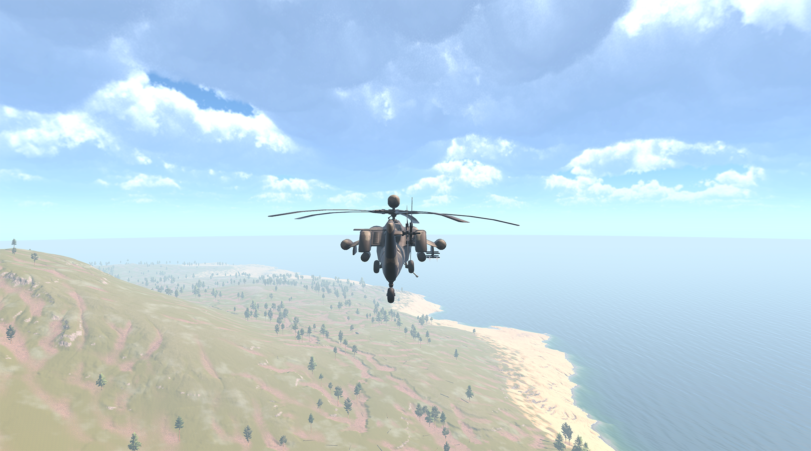

# Commander-s-View-WarzonDynamic-Codes
 

# Game Design Document

## Game Overview

### Title: Commander's View: Warzone Dynamics

Modern-era war game that represents a novel fusion of real-time strategy (RTS) and third-person shooter gameplay. Designed to appeal to audiences who enjoy both strategic depth and direct combat engagement, this game features a dual-phase mechanic where players can switch between a strategic RTS view to manage units while switching to the third-person perspective, demonstrating how the scenario could look from the perspective of a soldier. The game aims for a degree of realism, thus most of the projectiles leverage the Unity Physics Engine. The reason behind using the Unity physics system instead of raycasting is to be more like some of the games in the industry that are fun because they look real, such as War Thunder or World of Tanks. In these games, all projectiles are based on real physics, which gives them a uniqueness that attracts many players.

## Gameplay Description

- **Core Mechanics**: Utilizing resources and soldiers to destroy the enemy base.
- **Style**: Hybrid of RTS and 3rd person shooter.
- **Physics Engine**: Unity's physics engine for realistic projectile mechanics.
The player's goal is to take advantage of all the available tools to destroy the enemy base on the other side of the island. To do so, the player can shoot different kinds of missiles using the RTS style of the game or employ an attack helicopter for that purpose. Additionally, during the RTS phase of the game, the player can control friendly troops to achieve the game's objective.

## Input

- **RTS Phase**: Primarily mouse-based control.
- **3rd Person Shooter Phase**: Keyboard (A, W, S, D) and mouse (right and left click).
- **Shooting Mechanism**: Projectile physics.

## Visual Style
The game's Environment was created by the Gaia Pro 2023 to achieve a realistic environment.

## Audio Style

- Sourced primarily from freesound.org.
- Focus on realistic sound effects.

## Interface Sketches

